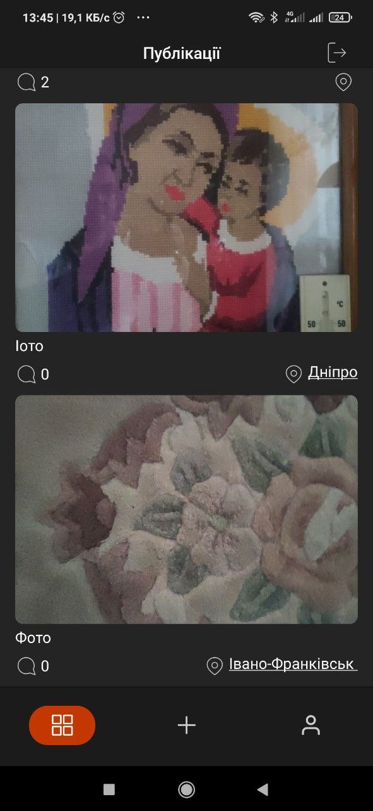
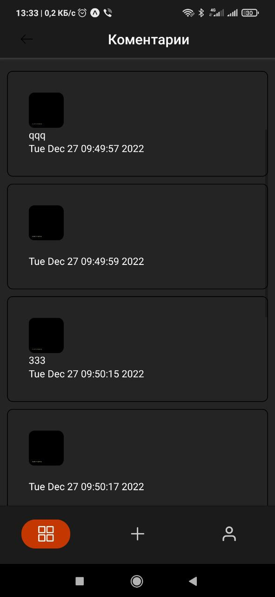

Start developing your project
You just created a new EAS project. Now, it's time to link this to your local project. There are two ways to accomplish this:

Create a new Expo project

Initialize an Expo codebase on your machine with Expo CLI:

npm install --global eas-cli
npx create-expo-app reactnativetask
eas init --id 4f3c2dac-9eb3-4917-a9bc-a71bdb21bd02
Link an existing Expo codebase

npm install --global eas-cli

eas init --id b8f6d2a7-f92b-4ed6-a908-4c1ada85521c
