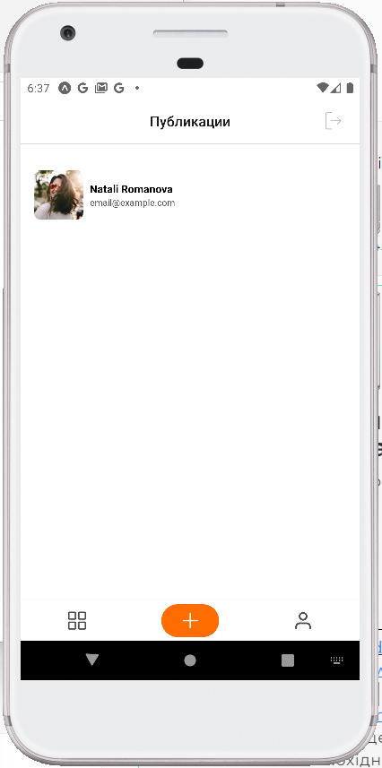
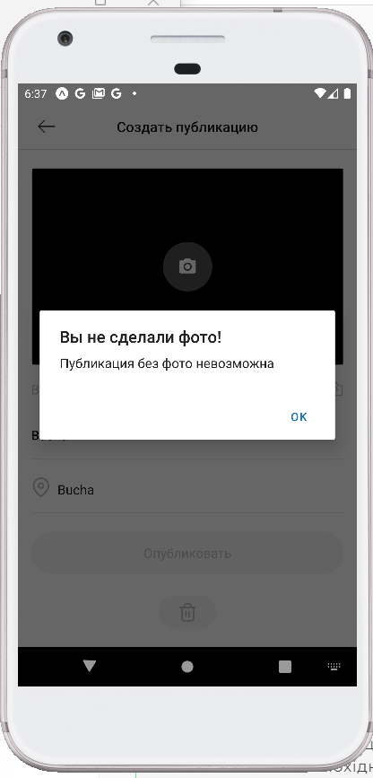
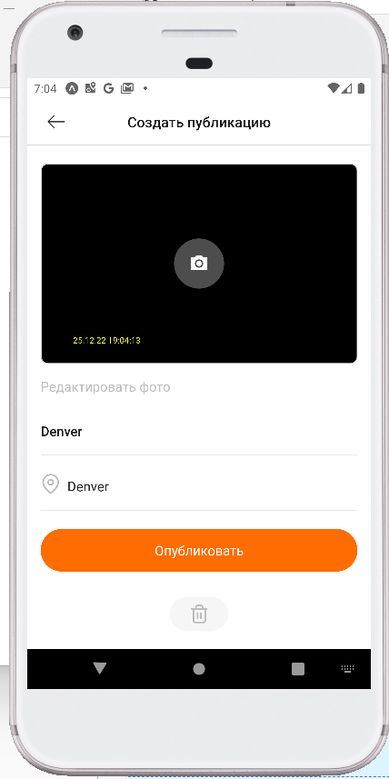
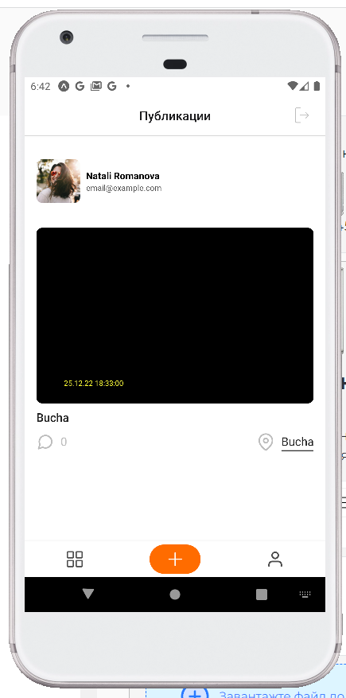
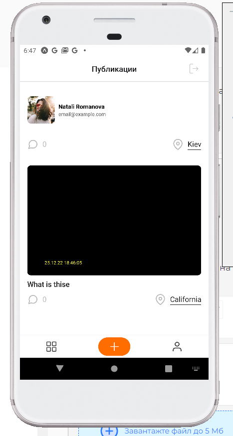
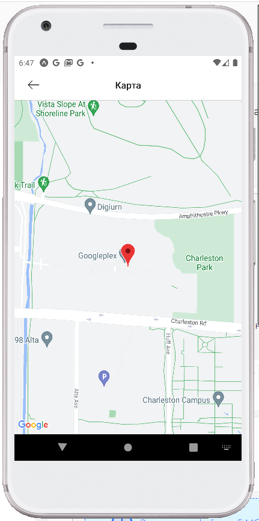
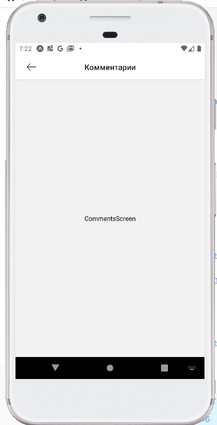

# React-Native-Task5
# Головний екран

# CreatePostsScreen

# Підключити камеру в компонент CreatePostsScreen;

# Під час відкриття екрану CreatePostsScreen активується камера і зображення з неї виводиться в блок з іконкою камери

# По кліку на іконку камери робиться знімок

# PostsScreen
# Екран після створення поста

# Виведення локації: У компоненті окремого посту під час кліку на іконку геолокації перекидає на екран MapScreen, де можна побачити мапу з маркером, де була зроблена фотографія

# Коментарі: В компоненті окремого посту при кліку на іконку коментарів перекидає на екран CommentsScreen
