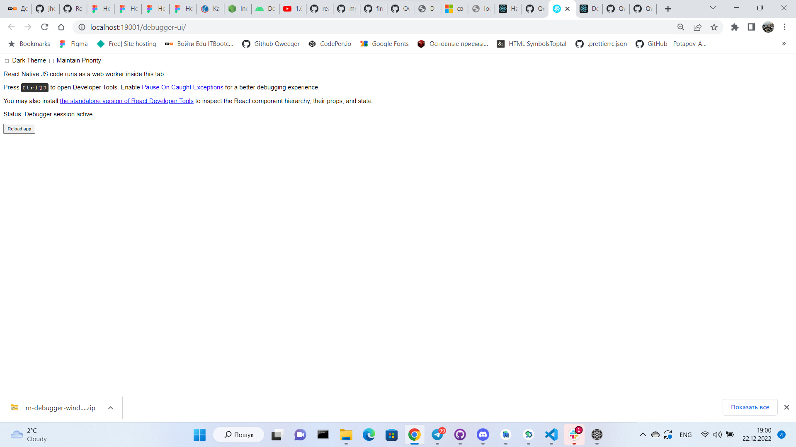
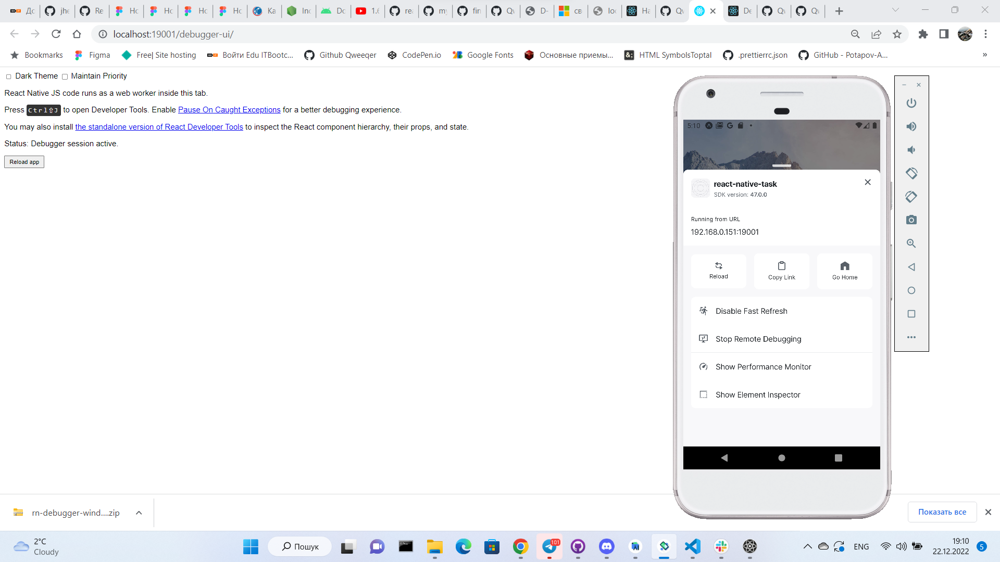
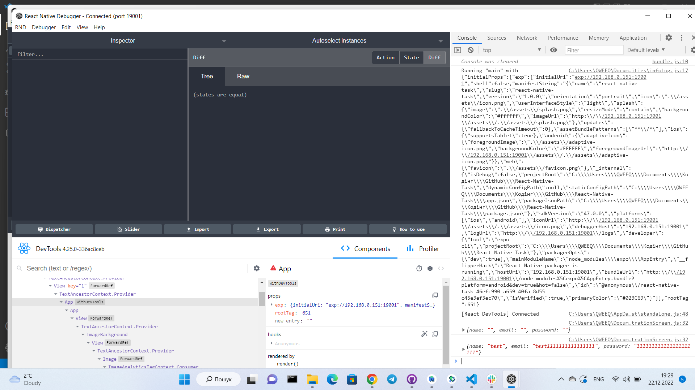
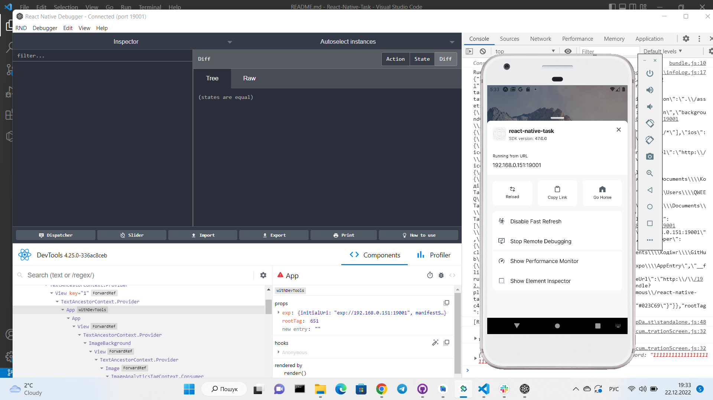

# React-Native-Task3

# Remote Debugger

http://localhost:190001/debugger-ui

# React Native Debugger

Запуск React Native Debugger команда Ctrl+T (на Windows/Linux)
Hомер порту, на якому відкривається Remote Debugger (19001)

Відкрито меню розробника та активовано Debug JS Remotely

